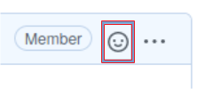

# community-roadmap

The [Senzing Community Roadmap](https://github.com/Senzing/community-roadmap/projects/1)
gives a peek into the future of the Senzing Community.
It is the public roadmap for requesting and following the growth of the Senzing Community offerings.

Visit the [Senzing Community Roadmap](https://github.com/Senzing/community-roadmap/projects/1).

## FAQs

1. **Q: What does each roadmap column mean?**
    1. *Requested* - This feature has been identified and will be evaluated for suitability.
    If this feature is of value to you,
    please [vote](#voting) giving it a "thumbs up" and perhaps leave a comment on
    *why* it is important to you.
    1. *Accepted* - This feature has been deemed worthy of development.
    Feel free to add comments on how to properly design the feature.
    1. *In progress* - Senzing is actively working on it.
    Comments are still welcome in this phase.
    1. *Shipped* - The feature has become available.
    Once shipped, requests for enhancement should be made in the specific repositories.
1. **Q: Why are no dates given on the Community Roadmap?**

   A: Senzing is a customer-focused company.
   When customer requirements come in, they take priority.
   If a particular feature request is of importance to you, give it a "thumbs up"
   to help Senzing prioritize based on customer needs.

1. **Q: Can I comment on a feature request?**

   A: Senzing encourages comments!
   Please add comments with any concerns, issues, or approaches you'd like Senzing to consider.

1. **Q: Are all future features listed in the roadmap?**

   A: Not necessarily.
   Although the many features are in the roadmap,
   future features can also be found in individual Senzing GitHub repositories.

1. **Q: How do I request a new feature?**

   A: See [How to request a new feature](#how-to-request-a-new-feature)

## How to request a new feature

1. To request a feature for a given repository, please visit the repository
   click on the "issues" link, click on the "New issue" button, and create a new
   "Feature request".
1. To request a feature that is not tied to a particular existing Senzing GitHub repository,
   create a new community-roadmap
   [feature request](https://github.com/Senzing/community-roadmap/issues/new?template=feature_request.md).

## Voting

Senzing follows the meaning of
[GitHub Reaction types](https://developer.github.com/v3/reactions/#reaction-types).
Meaning of reactions are used to determine priority:

1. :thumbsup: - Thumbs up. Essentially "+1".  Yes, I want this feature.
1. :thumbsdown: - Thumbs down. You guessed it, "-1".  Nope, not for me.

To vote for a feature, add a reaction:

1. Open the issue.
1. On the initial comment, click "smiley" icon to add a reaction

    
